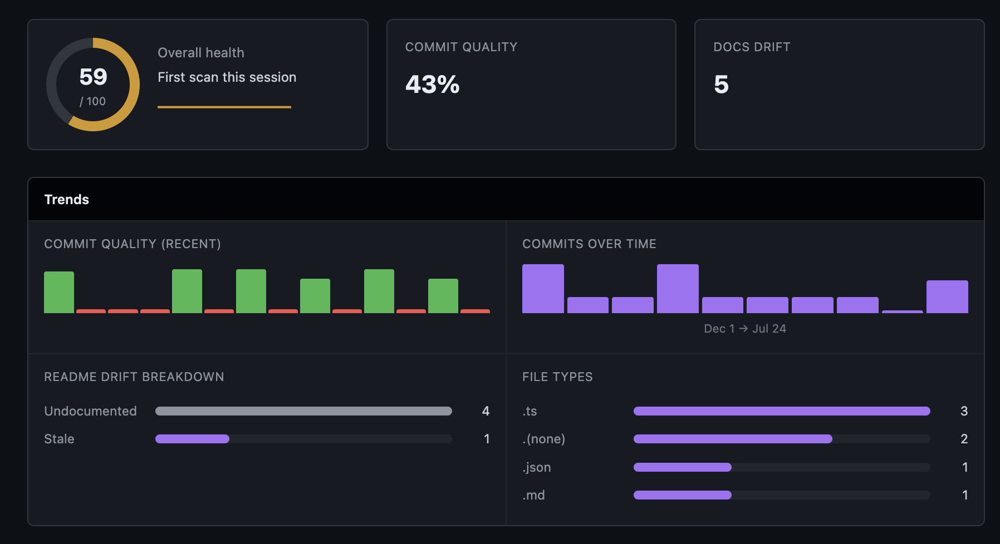
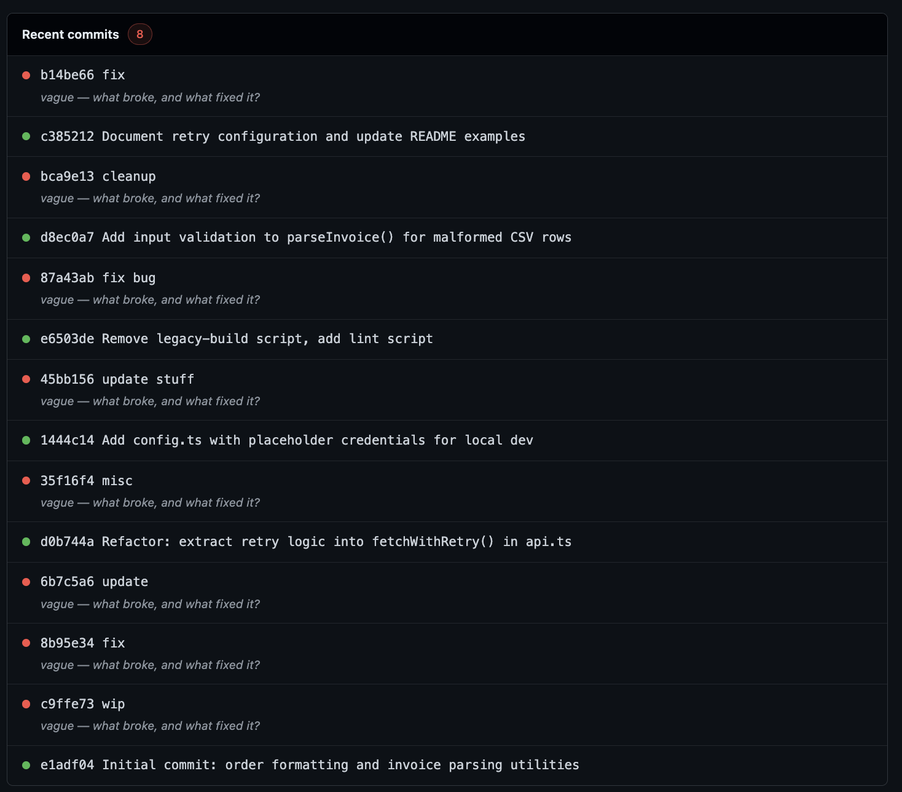
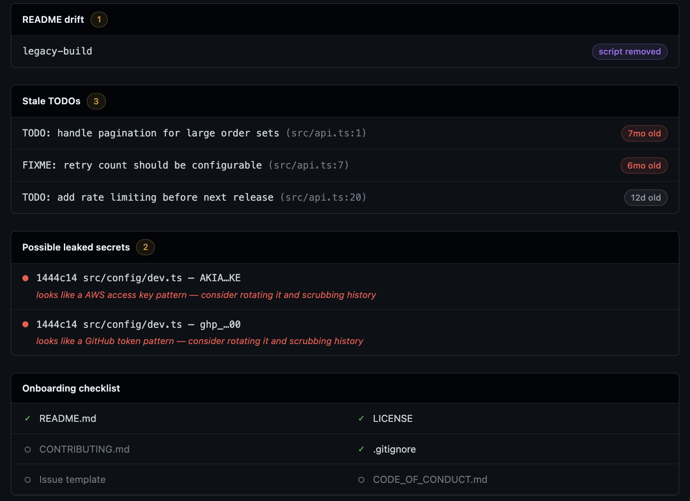

# Repo Health

A VS Code extension that surfaces repo hygiene issues that are normally
invisible day-to-day: vague commit messages, README that's drifted out of
sync with the code, stale TODOs, possible leaked secrets in commit
history, and a basic contributor-onboarding checklist. Everything shows
up in one dashboard, reachable from a status bar item that shows your
current score at a glance.

Everything here runs against `git log`/`git blame` output and the files
in your workspace — no network calls.

**[Get it on the VS Code Marketplace](https://marketplace.visualstudio.com/items?itemName=antoniaadelina.repo-health)**
— or search **"Repo Health"** in VS Code's Extensions panel.

> Published under the `antoniaadelina` publisher account
> (antoniaadelina94@gmail.com) — reach out there for support/issues, or
> use the GitHub issue tracker linked below.



## Features

**Commit message quality** — scores your recent commits and calls out
vague ones with a short, specific hint instead of just a red mark.



**README drift, stale TODOs, leaked secrets, and onboarding** — all in
the same dashboard, each with enough context to act on it directly.



**Always-visible score** — a status bar item shows your current score
and opens the dashboard on click. It refreshes automatically on save and
on commit, so it's never stale.


## Running it

```bash
npm install
npm run compile   # or: npm run watch
```

Then press `F5` in VS Code to launch an Extension Development Host with
the extension loaded, open a git repo in that window, and run **"Repo
Health: Show Dashboard"** from the Command Palette.

## Getting to the dashboard

The status bar item (bottom left, `$(shield) <score>`) is always visible
once the extension activates in a git workspace — colored red/yellow by
score band, click to open the dashboard. It populates itself shortly
after startup and refreshes on source/README saves and on commits or
branch switches (watches `.git/HEAD`). `repoHealth.showDashboard` and
`repoHealth.rescan` are also available from the Command Palette.

## Settings

| Setting | Default | Description |
| --- | --- | --- |
| `repoHealth.include` | `**/*.{ts,tsx,js,jsx,py}` | Glob of source files scanned for exports and TODO/FIXME. |
| `repoHealth.exclude` | `**/{node_modules,out,dist,build,.git,venv,.venv,__pycache__}/**` | Glob of paths to ignore. |
| `repoHealth.readmePath` | `README.md` | README file to check against, relative to the workspace root. |
| `repoHealth.commitScanCount` | `30` | How many recent commits to score for the dashboard. |
| `repoHealth.secretScanCommitDepth` | `50` | How many recent commits' diffs to scan for possible leaked secrets. |

## How each module works

Each module is simple and tunable on purpose — you should be able to read
the heuristic in five minutes and adjust it.

### Commit message quality (`src/modules/commitLinter.ts`)

- Reads recent commits via `git log` (shelled out directly, see
  `src/git.ts`, instead of adding `simple-git` as a dependency).
- Scores each message 0–100:
  - An exact-match denylist of generic messages (`fix`, `wip`, `update`,
    `misc`, `fix bug`, …), plus a broader check that catches messages
    made up only of generic/filler words even when the exact phrase
    isn't in the denylist (`"update stuff"`, `"minor changes"`).
  - Subject length (very short is a bad sign, a real sentence is good).
  - Whether it mentions something concrete: a file-like token
    (`parser.ts`), a camelCase/snake_case identifier, or an explanation
    after a colon/dash (`"refactor: extract token validation"`).
  - A small bonus for imperative-mood phrasing (`add`, `fix`, `remove`,
    `refactor`, …).
- Vague messages get a short hint (e.g. "vague — what broke, and what
  fixed it?") instead of just a score.
- Feeds the dashboard's "Recent commits" section and the "Commit
  quality" heat-strip, scanning the last N commits
  (`repoHealth.commitScanCount`, default 30).

An earlier version of this also tried a live, as-you-type warning under
the Git commit message box. That depends on a VS Code *proposed* API
(`SourceControlInputBox.validateInput` — the stable API only exposes
`value`/`placeholder`/`enabled`/`visible`, with no way to validate as you
type or listen for changes). Proposed APIs only run for extensions
launched with a special flag, so a normal install would've silently done
nothing. Dropped in favor of the batch scan, which works for everyone.

### README drift detector (`src/modules/readmeDrift.ts`)

No README convention actually expects every exported function to get a
mention — a full function inventory isn't a real signal of doc quality,
just noise (checked this against real README guides before landing on
this design). What a README's Features/Configuration/Getting Started
sections *are* expected to cover is the project's actual user-facing
surface. For a VS Code extension, that's what `package.json` itself
declares:

- **Undocumented**: a `contributes.commands` entry or
  `contributes.configuration` setting whose id (or command title) never
  appears anywhere in the README.
- **Stale**: a script, function call, command id, or setting key
  mentioned in a README code span/fenced block that no longer
  corresponds to anything real — `package.json` script, exported symbol
  (regex-scanned the same way as the drift checks used to work, still
  useful for catching a stale code example), declared command, or
  setting.

On a project with no `contributes` block (not a VS Code extension), the
command/setting checks simply produce nothing, so this still works as a
plain script/function drift check for other kinds of projects.

### Stale TODOs (`src/modules/staleTodos.ts`)

- Scans source files for `TODO`/`FIXME` comments.
- Runs `git blame` on each hit's line to find when it was introduced,
  and ages it in days. Untracked/uncommitted lines age as 0 days rather
  than being dropped.
- Sorted oldest first. Dashboard badges: 6+ months red, 1–6 months
  yellow, under a month gray.

### Possible leaked secrets (`src/modules/secretScanner.ts`)

- Scans `git log -p` over a bounded number of recent commits
  (`repoHealth.secretScanCommitDepth`, default 50, kept small for
  performance) for patterns that look like credentials: AWS keys
  (`AKIA[0-9A-Z]{16}`), GitHub tokens (`ghp_`/`gho_`/…), OpenAI-style
  keys (`sk-…`), Slack tokens (`xox…`), and a generic "assigned to a
  suspiciously-named variable" pattern (`token = "…20+ chars…"`).
- Regex pattern-matching produces false positives (test fixtures,
  placeholders, coincidentally key-shaped hashes) — the dashboard copy
  frames a hit as "go check this," not confirmation of a leak.
- Matches are redacted before display (first 4 / last 2 characters
  shown) even though the "secret" is already sitting in git history.

### Onboarding checklist (`src/modules/onboardingChecklist.ts`)

Existence checks: `README.md`, a `LICENSE` file, `CONTRIBUTING.md`,
`.gitignore`, an issue template under `.github/ISSUE_TEMPLATE/`, and
`CODE_OF_CONDUCT.md`.

### Scoring (`src/scoring.ts`)

Combines the modules above into one 0–100 score: commit quality (30%),
README drift (25%), stale TODOs (15%), leaked secrets (15%, heavy
penalty for any hit), onboarding completeness (15%). Tune the weights
freely. The dashboard also shows a trend versus your previous scan
(stored in workspace state, so it persists across dashboard opens).

### Dashboard (`src/webview/`)

A single Webview panel styled after GitHub's dark theme (Primer-ish
palette — background `#0d1117`, panel `#161b22`, borders
`#30363d`/`#21262d`, green/red/yellow/purple accents).
`src/webview/dashboard.html` is the static shell (CSS inline, no external
resources, no `<script>` — rendered with `enableScripts: false`);
`src/webview/panel.ts` fills in `{{PLACEHOLDER}}` tokens with real scan
results.

Besides the score/commits/drift/TODOs/secrets/onboarding sections, a
"Trends" row renders a few small charts — all CSS/SVG, no JavaScript:

- **Score history sparkline** (next to the gauge): overall score across
  scans, persisted per workspace.
- **Commit quality heat-strip**: one bar per recent commit, height/color
  keyed to its score.
- **Commits-over-time histogram**: commit counts bucketed across the
  scanned commit range.
- **README drift breakdown**: undocumented vs. stale as a bar comparison.
- **File types distribution**: file counts by extension across the repo.

## Known limitations (MVP)

- Regex-based export/TODO scanning, not a real parser — patterns like
  `export * from` or computed re-exports aren't picked up.
- README "documented" just means the name appears as a whole word
  somewhere — doesn't check that the surrounding text describes it.
- Single-root workspace assumption throughout.
- Secret scanning is regex pattern-matching over diff text — no entropy
  analysis, no verification against provider APIs.
- `git blame` runs once per TODO/FIXME hit, sequentially — fine for
  normal repos, slow if a codebase has hundreds of them (capped at 200).

## License

MIT
